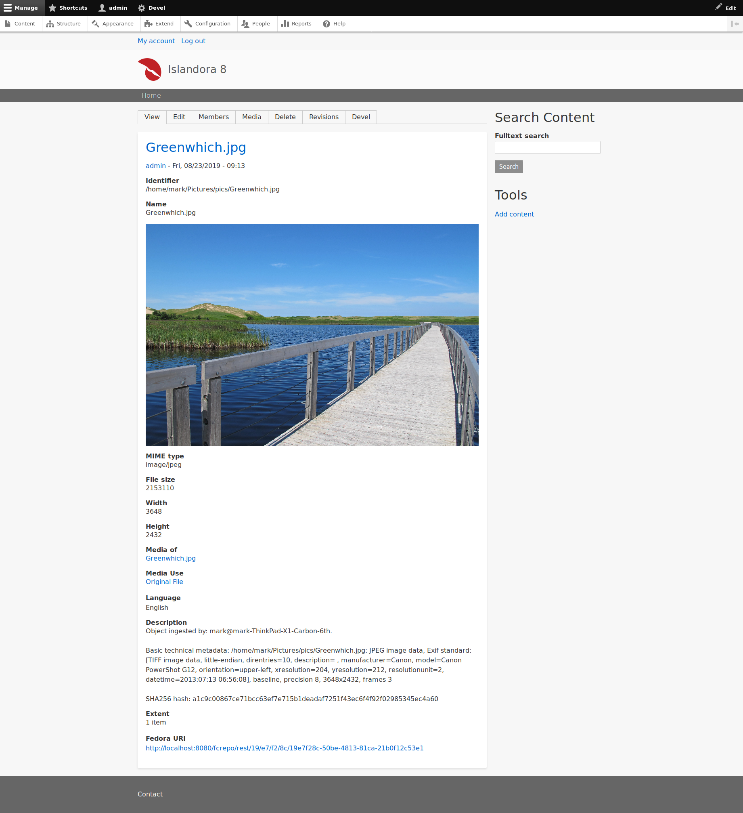

# Drop to Islandora

A proof of concept application demonstrating a headless Islandora. Provides a desktop shortcut for Ubuntu that lets users drop a file into Islandora, where a minimal node plus media is created.

## Requirements

* Works on Ubuntu 18.04, not sure whether it works on other Linux distros.
* Python 3 or higher
   * The [Requests](https://2.python-requests.org/en/master/) library.
* An [Islandora 8](https://islandora.ca/) repository.
   * Drupal's REST API must have "basic" authentication enabled.

## Installation

* `git clone https://github.com/mjordan/droptoislandora.git`

## Usage

### Preparing your desktop shortcut

1. Place the `droptoislandora.desktop` file in your Desktop folder.
1. Right click on the shortcut icon, and go to the "Properties" item.
    1. Adjust the path in the "Command" field so it points to your copy of `droptoislandora.py`.
    1. Go to the "Permissions" tab and check "Allow executing file as a program".

### Preparing your Python script

1. If necessary, change the config variables at the top of the `droptoislandora.py` script to match your Islandora instance.
1. If necessary, change the taxonomy term IDs in the section that starts with the comment `# Note: Taxonomy IDs for "Islandora Models" are hard coded here.` to match your Islandora instance.

### Dragging files up to Islandora

At this point, everything should be ready. If you drag and drop a file onto the desktop icon:

your file will be ingested into Islandora and you will see a notification indicating its URL:

Some metadata that can be automatically generated is included in the object:

## Contributing

Bug reports, improvements, feature requests, and PRs welcome. Before you open a pull request, please open an issue.

## License

The Unlicense.
